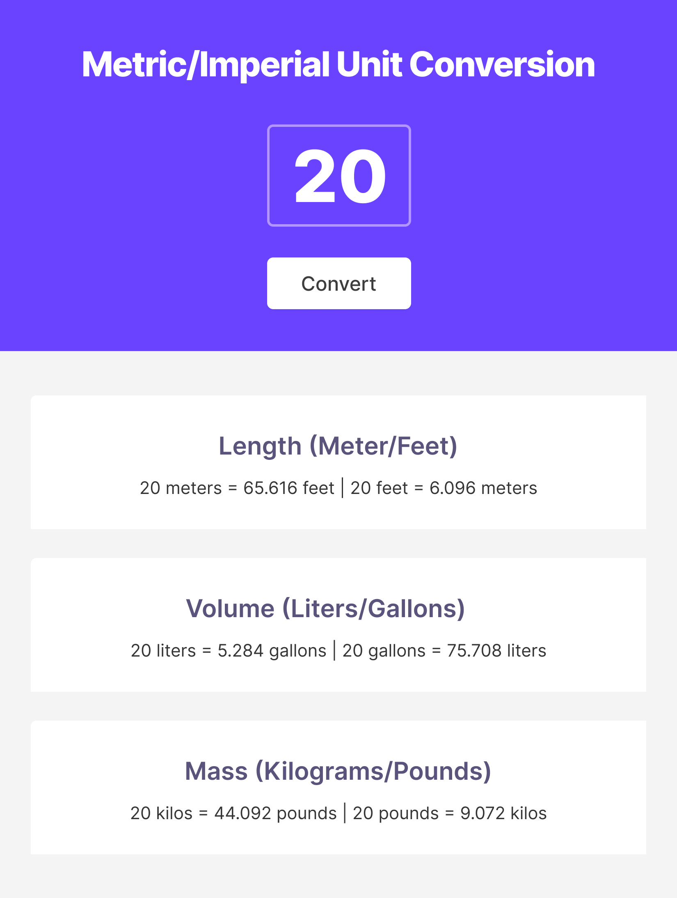

# 📏 Unit Converter

A simple and interactive **Unit Converter** built with HTML, CSS, and JavaScript.  
It allows users to instantly convert values across **Length, Volume, and Mass** with a clean interface and real-time results.  

## ✨ Features
- Convert between **meters ↔ feet**, **liters ↔ gallons**, **kilograms ↔ pounds**  
- Instant conversion on button click  
- Simple, lightweight, and responsive design  

## 🛠️ Tech Stack
- **HTML5**  
- **CSS3**  
- **JavaScript**  

## 🌐 View Project
[View on GitHub Pages](https://aditi-jadhav-arch.github.io/unit-converter/)  

## 📸 Preview

  

